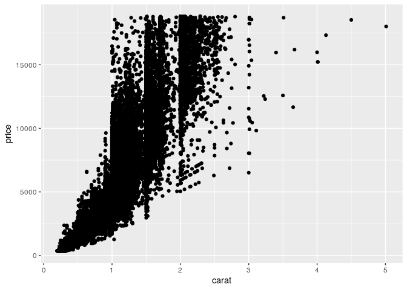
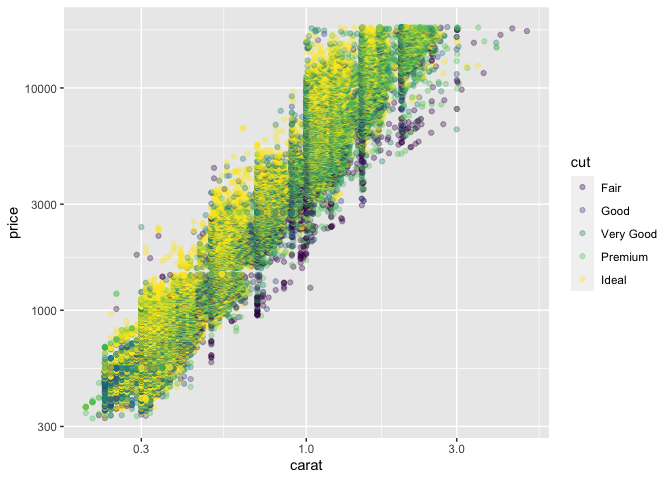
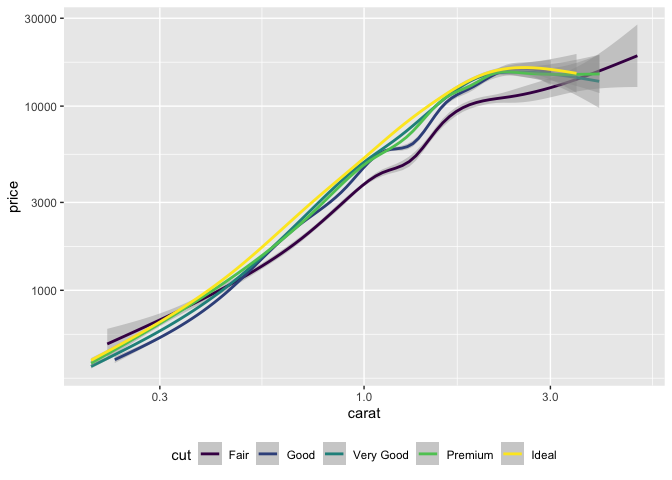
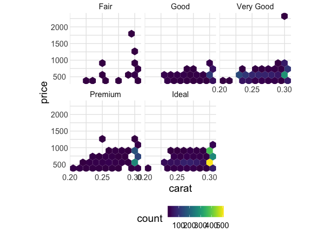
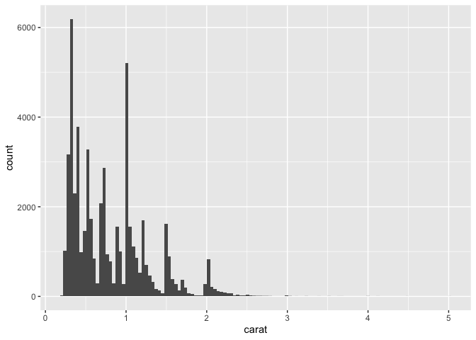
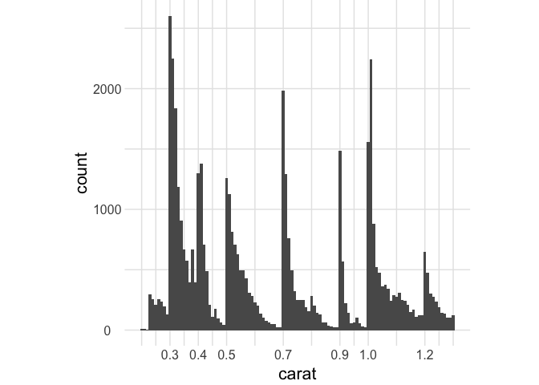

Getting Started: Diamonds
================
Zach del Rosario
2020-06-11

*Purpose*: Throughout this course, you’ll complete a large number of
*exercises* and *challenges*. Exercises are meant to introduce content
with easy-to-solve problems, while challenges are meant to make you
think more deeply about and apply the content. The challenges will start
out highly-scaffolded, and become progressively open-ended.

In this challenge, you will go through the process of exploring,
documenting, and sharing an analysis of a dataset. We will use these
skills again and again in each
    challenge.

<!-- include-rubric -->

``` r
library(tidyverse)
```

    ## ── Attaching packages ─────────────────────────────────────── tidyverse 1.3.0 ──

    ## ✔ ggplot2 3.3.1     ✔ purrr   0.3.4
    ## ✔ tibble  3.0.1     ✔ dplyr   1.0.0
    ## ✔ tidyr   1.1.0     ✔ stringr 1.4.0
    ## ✔ readr   1.3.1     ✔ forcats 0.5.0

    ## ── Conflicts ────────────────────────────────────────── tidyverse_conflicts() ──
    ## ✖ dplyr::filter() masks stats::filter()
    ## ✖ dplyr::lag()    masks stats::lag()

``` r
library(rzdr)
```

# Background

<!-- -------------------------------------------------- -->

Since I’m presenting, I’ll add a bit of background on the data:

*Aside*: It’s always a good idea to do a `glimpse` and `summary` first:

``` r
diamonds %>% glimpse()
```

    ## Rows: 53,940
    ## Columns: 10
    ## $ carat   <dbl> 0.23, 0.21, 0.23, 0.29, 0.31, 0.24, 0.24, 0.26, 0.22, 0.23, 0…
    ## $ cut     <ord> Ideal, Premium, Good, Premium, Good, Very Good, Very Good, Ve…
    ## $ color   <ord> E, E, E, I, J, J, I, H, E, H, J, J, F, J, E, E, I, J, J, J, I…
    ## $ clarity <ord> SI2, SI1, VS1, VS2, SI2, VVS2, VVS1, SI1, VS2, VS1, SI1, VS1,…
    ## $ depth   <dbl> 61.5, 59.8, 56.9, 62.4, 63.3, 62.8, 62.3, 61.9, 65.1, 59.4, 6…
    ## $ table   <dbl> 55, 61, 65, 58, 58, 57, 57, 55, 61, 61, 55, 56, 61, 54, 62, 5…
    ## $ price   <int> 326, 326, 327, 334, 335, 336, 336, 337, 337, 338, 339, 340, 3…
    ## $ x       <dbl> 3.95, 3.89, 4.05, 4.20, 4.34, 3.94, 3.95, 4.07, 3.87, 4.00, 4…
    ## $ y       <dbl> 3.98, 3.84, 4.07, 4.23, 4.35, 3.96, 3.98, 4.11, 3.78, 4.05, 4…
    ## $ z       <dbl> 2.43, 2.31, 2.31, 2.63, 2.75, 2.48, 2.47, 2.53, 2.49, 2.39, 2…

The glimpse shows us what variables are in the dataset, and a handful of
values just to get a sample of what we
    have.

``` r
diamonds %>% summary()
```

    ##      carat               cut        color        clarity          depth      
    ##  Min.   :0.2000   Fair     : 1610   D: 6775   SI1    :13065   Min.   :43.00  
    ##  1st Qu.:0.4000   Good     : 4906   E: 9797   VS2    :12258   1st Qu.:61.00  
    ##  Median :0.7000   Very Good:12082   F: 9542   SI2    : 9194   Median :61.80  
    ##  Mean   :0.7979   Premium  :13791   G:11292   VS1    : 8171   Mean   :61.75  
    ##  3rd Qu.:1.0400   Ideal    :21551   H: 8304   VVS2   : 5066   3rd Qu.:62.50  
    ##  Max.   :5.0100                     I: 5422   VVS1   : 3655   Max.   :79.00  
    ##                                     J: 2808   (Other): 2531                  
    ##      table           price             x                y         
    ##  Min.   :43.00   Min.   :  326   Min.   : 0.000   Min.   : 0.000  
    ##  1st Qu.:56.00   1st Qu.:  950   1st Qu.: 4.710   1st Qu.: 4.720  
    ##  Median :57.00   Median : 2401   Median : 5.700   Median : 5.710  
    ##  Mean   :57.46   Mean   : 3933   Mean   : 5.731   Mean   : 5.735  
    ##  3rd Qu.:59.00   3rd Qu.: 5324   3rd Qu.: 6.540   3rd Qu.: 6.540  
    ##  Max.   :95.00   Max.   :18823   Max.   :10.740   Max.   :58.900  
    ##                                                                   
    ##        z         
    ##  Min.   : 0.000  
    ##  1st Qu.: 2.910  
    ##  Median : 3.530  
    ##  Mean   : 3.539  
    ##  3rd Qu.: 4.040  
    ##  Max.   :31.800  
    ## 

The summary gives us a set of standard statistics for each of the
variables. This gives us a sense of “scale” for each variable.

## Pricing and the 4 C’s

<!-- ------------------------- -->

Diamond pricing is traditionally based on the “Four C’s”: cut, color,
clarity, and carat. Three of those variables are *factors*: discrete
variables with fixed *levels*.

[Diamond cuts](https://en.wikipedia.org/wiki/Diamond_cut) are fairly
elaborate, with many different styles. However the [American Gem
Society](https://en.wikipedia.org/wiki/American_Gem_Society) publishes
standards for its own cut grade ranking, which ranges from `Fair` to
\`Ideal.

``` r
diamonds %>%
  pull(cut) %>%
  levels()
```

    ## [1] "Fair"      "Good"      "Very Good" "Premium"   "Ideal"

  - `Fair` is the lowest (least valuable) level
  - `Ideal` is the highest (most valuable) level

<!-- end list -->

``` r
diamonds %>%
  pull(color) %>%
  levels()
```

    ## [1] "D" "E" "F" "G" "H" "I" "J"

[Diamond colors](https://en.wikipedia.org/wiki/Diamond_color) range from
colorless `D` to more colorful `J`. Grades above `J` exist with more
apparent color.

``` r
diamonds %>%
  pull(clarity) %>%
  levels()
```

    ## [1] "I1"   "SI2"  "SI1"  "VS2"  "VS1"  "VVS2" "VVS1" "IF"

[Diamond clarity](https://en.wikipedia.org/wiki/Diamond_clarity) refers
to the lack of inclusions (internal defects) and blemishes (surface
defects).

  - `I1` refers to the *included* category, meaning undesirable
    inclusions are visible to the naked eye. This is the lowest level.
  - `IF` refers to *internally flawless*, which is the highest level in
    the dataset.
  - `FL` refers to *flawless*, which is rare and refers to a diamond
    with neither inclusions nor blemishes.

[Carat](https://en.wikipedia.org/wiki/Carat_\(mass\)) is a unit of mass
often used for gems. This is a continuous variable. Generally we would
expect higher carat to correspond to a higher sale price.

# Data Exploration

<!-- -------------------------------------------------- -->

In this first stage, you will explore the `diamonds` dataset and
document your observations.

**q1** Create a plot of `price` vs `carat` of the `diamonds` dataset
below. Document your observations from the visual.

*Hint*: We learned how to do this in `e-vis00-basics`\!

``` r
## TASK: Plot `price` vs `carat` below
diamonds %>%
  ggplot(aes(carat, price)) +
  geom_point()
```

<!-- -->

**Observations**:

  - `price` generally increases with `carat`
  - The trend is not ‘clean’; there is no single curve in the
    relationship

**q2** Create a visualization showing variables `carat`, `price`, and
`cut` simultaneously. Experiment with which variable you assign to which
aesthetic (`x`, `y`, etc.) to find an effective visual.

``` r
## TASK: Plot `price`, `carat`, and `cut` below
diamonds %>%
  ggplot(aes(carat, price, color = cut)) +
  geom_point(alpha = 1 / 3) +
  scale_x_log10() +
  scale_y_log10() +
  theme_common()
```

<!-- -->

**Observations**:

  - `price` generally increases with `carat`
      - Furthermore the trend is roughly linear on a log-log scale; this
        implies a power-law relation between `price` and `carat`
  - The `cut` helps explain the variation in price;
      - `Ideal` cut diamonds tend to be more expensive
      - `Fair` cut diamonds tend to be less expensive

**Elaboration**:

The figure above is rather busy; let’s make a simpler visual with
smoothed trends.

``` r
diamonds %>%
  ggplot(aes(carat, price, color = cut)) +
  geom_smooth() +
  scale_x_log10() +
  scale_y_log10() +
  theme_common() +
  theme(legend.position = "bottom")
```

    ## `geom_smooth()` using method = 'gam' and formula 'y ~ s(x, bs = "cs")'

<!-- -->

**Observations**:

  - The relationships between `price` and `carat` is very nearly linear
    when plotted on a log-log scale\!
      - Furthermore, the slope seems to be constant across different
        `cut` values.
  - At low `carat`, the `Fair` diamonds appear to be the most expensive.
    Is this a real trend?
      - Note that the confidence band for `Fair` overlaps the other
        curves, so this is already not a robust conclusion.
  - At very high `carat`, the price of `Fair` diamonds again become most
    expensive.

Let’s follow up the low-carat diamonds:

``` r
diamonds %>%
  filter(carat <= 0.3) %>%

  ggplot(aes(carat, price)) +
  geom_hex(bins = 10) +

  scale_x_continuous(breaks = c(0.2, 0.25, 0.3)) +
  viridis::scale_fill_viridis() +
  facet_wrap(~cut) +
  theme_common() +
  theme(legend.position = "bottom")
```

<!-- -->

**Observations**:

  - The `Fair` observations are far more sparse than other `cut`s in the
    `carat <= 0.3` range.
  - Based on observation, the bulk of `Fair` diamonds do not appear to
    be of especially high `price`.
      - However, there is an outlier in `price` at `carat` near `0.3`.
        This may be dragging the trend line up.
  - Ultimately, the small sample size, edge effect, and the outlier can
    explain the odd phenomenon with `Fair` in the smoothed trend above.
    This casts doubt on the conclusions that small `Fair` diamonds are
    genuinely more expensive.

# Bonus Observations

We haven’t gotten to this point in the exercise sequence yet, but it’s
usually a good idea to start with 1-dimensional investigations of the
data when doing EDA. There’s a very interesting pattern just within the
distribution `carat` values.

``` r
diamonds %>%
  ggplot(aes(carat)) +
  geom_histogram(bins = 120) +
  theme_common()
```

<!-- -->

**Observations**:

  - Even with a large number of bins there are very tall peaks. Let’s
    zoom in a bit to inspect closer.

<!-- end list -->

``` r
wid <- 0.01
diamonds %>%
  filter(carat <= 1.3) %>%
  ggplot(aes(carat)) +
  geom_histogram(boundary = wid / 2, binwidth = wid) +
  scale_x_continuous(
    breaks = c(0.3, 0.4, 0.5, 0.7, 0.9, 1, 1.2)
  ) +
  theme_common()
```

<!-- -->

**Observations**:

  - There appear to be peaks in `carat` at particular `0.1` increments.
  - These peaks tend to have a sharp drop to their left (lower values),
    with a slower dropoff to their right (higher values).
  - Since these diamonds are meant for sale, these patterns are likely
    reflect the desires of the market: i.e. people desire diamonds at
    these specific carat values, and will buy diamonds slightly above
    (but not slightly below) those values.
